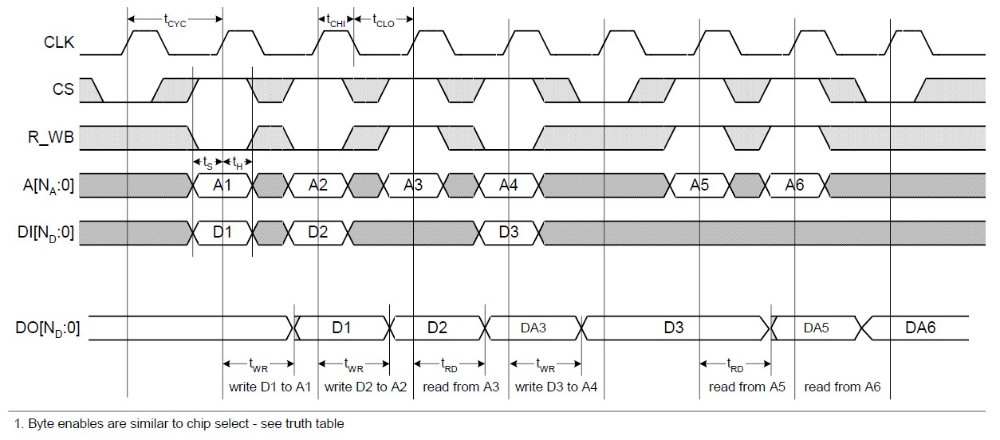
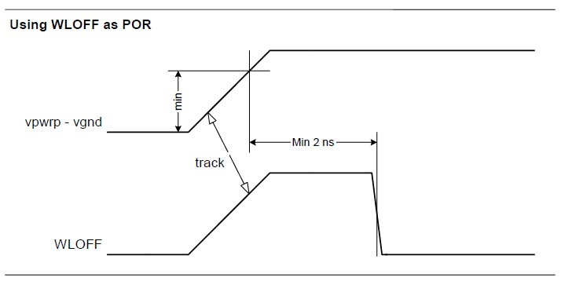
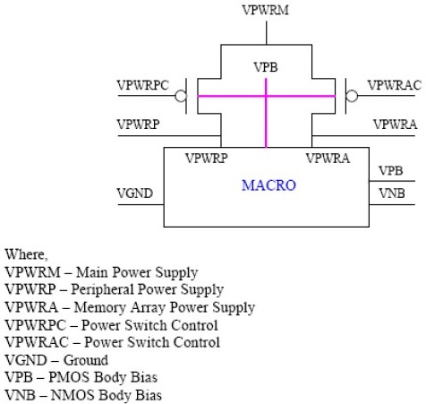
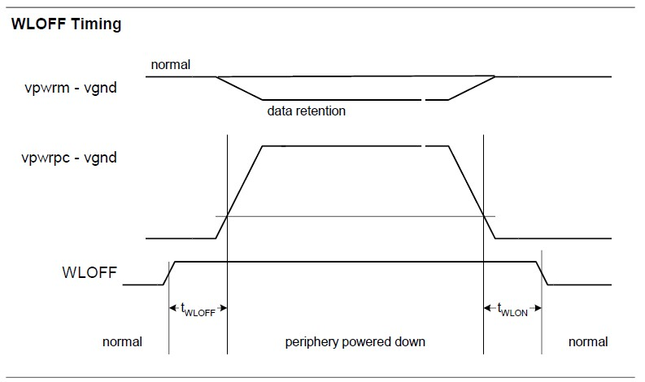
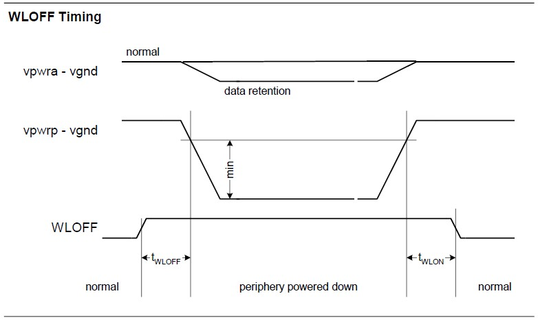
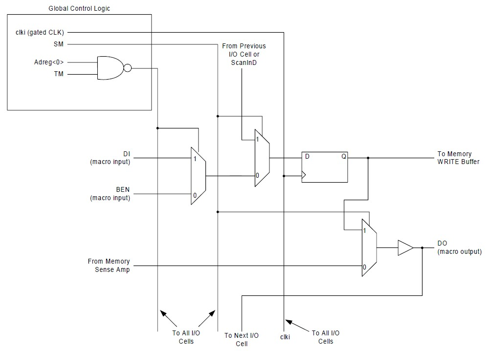

# CF_SRAM INTEGRATION

**Application Note**  
**Revision 1.0**  
**September 18, 2025**


---

## About this document

### Scope and purpose
This document describes the integration requirements and constraints for the implementation of CF_SRAM macros into SoC & Chip designs.

### Intended audience
The intended audiences for this document are design engineers integrating CF_SRAM macros.

---

## Table of contents

1. [IP CRITICAL REQUIREMENTS SUMMARY](#1-ip-critical-requirements-summary)  
1.1 [Overview of Block Applications](#11-overview-of-block-applications)  
1.2 [Block Architecture Overview](#12-block-architecture-overview)  
1.2.1 [Block Description](#121-block-description)  
1.2.1.1 [Memory Bit Maps](#1211-memory-bit-maps)  
1.2.2 [Block Pin List](#122-block-pin-list)  
1.2.2.1 [DFT, BIST Pins](#1221-dft-bist-pins)  
1.2.2.2 [Bulk Pins](#1222-bulk-pins)  
1.2.2.3 [Power Supply Pins](#1223-power-supply-pins)  
1.2.2.4 [I/O Pins](#1224-io-pins)  
1.2.2.5 [Full Pin List](#1225-full-pin-list)  
1.2.3 [Timing Requirements and Diagrams](#123-timing-requirements-and-diagrams)  
1.2.4 [Block Level Interfaces](#124-block-level-interfaces)  
1.2.5 [Reset and Initialization](#125-reset-and-initialization)  
1.2.6 [Power Modes](#126-power-modes)  
1.2.6.1 [Active](#1261-active)  
1.2.6.2 [Data Retention](#1261-active)  
1.2.6.3 [Sleep Mode (Macro Deselected)](#1263-sleep-mode-macro-deselected)  
1.2.6.4 [Deep Sleep Mode (Periphery Power Down)](#1264-deep-sleep-mode-periphery-power-down)  
1.2.7 [Test Modes](#127-test-modes)  
1.2.7.1 [Scan Test Mode](#1271-scan-test-mode)  
1.3 [Block Integration Requirements and Constraints](#13-block-integration-requirements-and-constraints)  
1.3.1 [General Integration Requirements](#131-general-integration-requirements)  
1.3.1.1 [Usage Guidelines](#1311-usage-guidelines)  
1.3.1.2 [Library Timing](#1312-library-timing)  
1.3.2 [WLOFF/WLBI](#132-wloffwlbi)  
1.3.3 [Power Constraints](#133-power-constraints)  
1.3.4 [Bus Interface Physical Interface Requirements](#134-bus-interface-physical-interface-requirements)  
1.3.5 [Miscellaneous Constraints](#135-miscellaneous-constraints)  
1.3.6 [Block Symbol](#136-block-symbol)  
[Important Notice and Disclaimer](#important-notice-and-disclaimer)  

---

## 1. IP CRITICAL REQUIREMENTS SUMMARY

### 1.1 Overview of Block Applications

This is a Single Port Synchronous SRAM in sky130 technology. An active high read-write enable signal controls the read/write operation of the memory. When bit-enable is high and read-write enable is low, data on the data input pin is written into the memory location addressed by the address present on the address pins. Reading the device is accomplished while read-write enable is high. Under these conditions, the contents of the location addressed by the information on address lines is present on the data output pin. In write cycle, data to be written is driven onto data output pin. If there is no read or write, while memory is enabled, data output pin will hold previous data.

### 1.2 Block Architecture Overview

#### 1.2.1 Block Description

Inputs are sampled on the rising clock edge and outputs are flow through. There are separate data inputs and outputs, and data out becomes equal to data in during a write cycle. Standard control pins for macro select, and read/write are provided.

Bit enables are available for masking individual IOs during write. 

Separate nwell and pwell terminals are available to allow the application of body bias for power/speed control (PMOS body = vpb – nwell voltage, NMOS body = vnb – pwell/psub).

Separate power connections for periphery and core are provided. When vpwrpc is low, periphery is connected to the vpwrm power supply through power switch and when vpwrac is low, array is connected to the vpwrm power supply through power switch. If power switch feature is not used, vpwrp and vpwra pins are used to supply power to periphery and array respectively. There is a wordline clamp signal that will force all wordlines to vgnd, allowing the periphery power to be removed and reducing leakage.

##### 1.2.1.1 Memory Bit Maps

The rows are decoded from the bottom edge of the array. The columns are distributed left and right of the centered row decoder. There are two levels of column multiplexing; 8:1 before the sense amplifier, 4:1 or 2:1 after the sense amplifier.

The LSB address bits are used for column multiplexing. MSB bits are used for row decoding. Bit (IO) counting starts from the center outward. First left side bits are counted then right side bits.

#### 1.2.2 Block Pin List

##### 1.2.2.1 DFT, BIST Pins

There are 6 SCAN pins (ScanInCC, ScanInDL, ScanInDR, ScanOutCC, TM and SM), WLBI (Wafer Level Burn In) and a WLOFF pin for DFT usage.

##### 1.2.2.2 Bulk Pins

The bulk terminals are available within the macros. The vnb terminal is used to bias the N devices. The vpb terminal is available for the P devices. The SRAM macro is inside a Deep Nwell to allow body biasing.

##### 1.2.2.3 Power Supply Pins

The internal voltage states of the vpwra and vpwrp power supplies are a function of the following signals:

1. vpwrac - (gate control of p-channel power switch from vpwrm to vpwra)
2. vpwrpc - (gate control of p-channel power switch from vpwrm to vpwrp)  
3. vpwrm - (main macro power supply input)

##### 1.2.2.4 I/O Pins

Data from the memory location selected by address is driven onto DO during a read cycle. In a write cycle, data to be written is driven onto DO. If there is no read or write, while memory is enabled, DO will hold previous data.

##### 1.2.2.5 Full Pin List

Click for the full [pinlist](cf_sram_pin_descriptions.md).

#### 1.2.3 Timing Requirements and Diagrams

1. Byte enables are similar to chip select - see truth table



**Figure 1**: Timing Diagram for Read, Write

#### 1.2.4 Block Level Interfaces

The block has CMOS inputs and outputs. All input loads except clock input are equivalent to a minimum gate and all output drive strengths are equivalent to a 6X gate in the sky130 standard cell library. The clock input load is larger than other input loads.

#### 1.2.5 Reset and Initialization

The SRAM array will power-up with random data.

With WLOFF held low, the active/deselected/read/write mode of the SRAM will be random at power up, but there will be no active current if the clock input (CLKin) is low. There may be active current in the memory if the CLKin input is high since a random memory wordline may be selected and driven ON. A subsequent EN low, rising edge of CLKin combination will deselect the macro, or gate the register inputs from switching.

WLOFF high will prevent READ and WRITE of the memory independent of the EN input to the macro. This may be used at power up (POR) and must be used if the macro periphery is powered down and up while the array is kept on for data retention.


**Figure 2**: Timing of VPWRPC, WLOFF, Power Switch Used



**Figure 3**: Timing of VPWRP, WLOFF, Power Switch *Not* Used

Care must be taken not to forward bias any junctions into conduction (see relative power below as power is applied to avoid forward biasing), especially at power up.

**Table 1**: Relative Power Supply Settings to Avoid Forward Biasing

| Power Switch Used | Power Switch Not Used |
|-------------------|----------------------|
| vpb (nwell) >= vpsub | vpb (nwell) >= vpsub |
| vpb >= vpwrm | vpb >= vpwra |
| vgnd >= vnb (pwell) | vpb >= vpwrp |
| vpb >= vnb | vgnd >= vnb (pwell) * |
|  | vpb >= vnb |

\* junction may be up to 100 mV forward biased for FET reverse body bias

The power up sequence to avoid diodes to turn on should be as shown in the table below (allow sufficient time for supplies reach voltage levels).

**Table 2**: Power Up Sequence With, Without Power Switch

| Sequence | Power Switch Used | Power Switch Not Used |
|----------|-------------------|----------------------|
| 1 | Hold vpsub = 0 V (vpwrpc and vpwrac are at nom 0 V) | Hold vpsub = 0 V (vpwrac and vpwrpc are at 1.8V) |
| 2 | Apply nom 1.8 V to vpb | Apply nom 1.8 V to vpb |
| 3 | Apply nom 1.8 V to vpwrm | Apply nom 1.8 V to vpwra and vpwrp |
| 4 | Apply nom 0 V to vnb | Apply nom 0 V to vnb |
| 5 | Apply nom 0 V to vgnd | Apply nom 0 V to vgnd |

#### 1.2.6 Power Modes

Power modes are determined by the voltages on the vpwra and vpwrp macro power supply signals and the voltages on the other macro power and bias pins vpb, vnb, and vgnd. The memory macro includes integrated power switches for the vpwra and vpwrp supplies. A simplified circuit diagram of these power switches is shown in the figure below.



**Figure 4**: Simplified Power Switch Circuit

The power switch network shown above is modeled with "bufif0" switches in the memory macro Verilog behavioral model. Thus the states of the macro power pins "vpwrp" and "vpwra" are resolved by the simulator based on the input states of these pins, "vpwrm", "vpwrpc", and "vpwrac".

##### 1.2.6.1 Active

Active mode may short vpwrm (or vpwra & vpwrp) and vpb, and similarly, vgnd and vnb. The nominal value of vpwrm (or vpwra & vpwrp) is 1.8 V (direct or regulated) relative to vgnd, which in turn is usually 0 V. The macro may be reading, writing or deselected.

However, speed/power optimization may be achieved through controlling any one or more of:

1. vpwrm (or vpwra & vpwrp) relative to vgnd
2. vpwrm (or vpwra & vpwrp) relative to vpb (PMOS body bias), if not shorted
3. vgnd relative to vnb (NMOS body bias), if not shorted

In forward body bias, vpwr* may only be higher than vpb by <=0.1 V, and vgnd may only be lower than vnb by <=0.1 V, for compatibility with the simulation models. The amount of reverse bias possible is limited only by the need to keep (vpwra - vgnd) sufficiently large for data retention.

The macro will function over the range [1.3 V, 2.0 V].

##### 1.2.6.2 Data Retention

Core leakage may be reduced by lowering (vpwra-vgnd) and/or applying body bias. Data will be retained down to a supply approaching a Vt. However, the soft error rate (SER) will increase as the power supply voltage is lowered and will set the lower practical limit on power supply voltage. SER testing of silicon must be performed to evaluate the impact.

Note – If power switch feature is used then lowering (vpwra-vgnd) is done by lowering (vpwrm-vgnd) or by shutting off power switches and controlling vpwra directly.

##### 1.2.6.3 Sleep Mode (Macro Deselected)

A proposed leakage reduction scheme uses the following voltages to apply reverse body bias to the transistors:

- vpb = highest available supply, 1.7 V minimum
- vpwr* = 1.2 V (buffered bandgap reference voltage)  
- vgnd = vnb = 0 V

Other schemes, e.g. vpwr* current source, are possible.

##### 1.2.6.4 Deep Sleep Mode (Periphery Power Down)

A decrease in DC leakage may be obtained by powering down the periphery (vpwrpc is high or vpwrp is low). Before this is done, WLOFF must be asserted high and CLK pin is held low. To retain data in the memory, the array must remain powered through vpwrm (vpwrac must be low) or vpwra, possibly at a lower voltage than nominal. Power must be re-established to the periphery before WLOFF is de-asserted and the macro returns to active mode (but deselected). Additional energy will be required to charge up periphery again – this will offset the power saving obtained during sleep.

tWLOFF = min tCYC  
tWLON = min tCYC

If the power switch is not used then the signals vpwrpc and vpwrac must be held in a logic "1" state so that vpwra and vpwrp are independent, i.e. not both connected to vpwrm through the power switches.



**Figure 5**: Timing of VPWRPC, VPWRM, WLOFF, Power Switch Used



**Figure 6**: Timing of VPWRA, VPWRP, WLOFF, Power Switch *Not* Used

Note – If power switch feature is not used then vpwra and vpwrp can be used as core power supply and periphery power
supply respectively.

#### 1.2.7 Test Modes

Scan and Wafer-Level Burnin (WLBI) test modes are implemented in this SRAM. Implementation and operation of these modes is described below.

##### 1.2.7.1 Scan Test Mode

Scan test mode is accessed by setting the input TM (Scan Test Enable) to logic 1. The scan mode has three independent sets of registers:

1. **control & address**: 14 bits for all macro configurations (unused macro address inputs are tied to logic 0 for macros not requiring all address inputs for the selected memory configuration)
   - scan input is ScanInC
   - scan output is ScanOutC (NOTE: ScanOutC polarity is inverse of ScanInC and address/control inputs polarity)
   - scan bit order (first out to last out) is a function of macro configuration (# rows and # cols per IO)

2. **Data Left**: variable # of bits: (1/2 of bits) for even number of IO, (1/2 of (bits+1)) for odd number of IO
   - scan input is ScanInDL.
   - scan input goes to DI<0> data register
   - scan output: DO<(NB/2)-1> for even number of IO

3. **Data Right**: variable # of bits: (1/2 of bits) for even number of IO, (1/2 of (bits-1)) for odd number of IO
   - scan input is ScanInDR
   - scan input goes to DI<NB/2> register for even number of IO
   - scan input goes to DI<(NB+1)/2> register for odd number of IO
   - scan output is DO<NB-1>

There are two configurations of the registers in scan test mode:

1. **Scan (SM=1)**: registers are configured to shift data from scan input to scan output
2. **Parallel Load (SM=0)**: registers are configured to parallel load data from inputs
   - address and control registers input is from associated address and control inputs
   - Data scan registers parallel input is from one of two sources:
     - DI for AD<0> register = 0
     - BEN for AD<0> register = 1
     - the contents of the AD<0> register can be set by scan mode shift (through ScanInC) or parallel load (through AD<0>)



**Figure 7**: Simplified Data Path With Scan

## 1.3 Block Integration Requirements and Constraints

### 1.3.1 General Integration Requirements

#### 1.3.1.1 Usage Guidelines

A nominal 1.8 V power supply is required. Application and Chip Integration usage guidelines are described in the following sections.

#### 1.3.1.2 Library Timing

The library file timing values at the different conditions reflect the following conditions. The library file timing values for critical timing parameters for input rise/fall time and output load. The timing parameter values used in the lib file for each simulation condition are given in the table below.

**Table 4**: Basis for Values Found in Liberty Files

| Parameter | SS 1.60V -40C | SS 1.60V 150C | TT 1.80V 25C | FF 1.95V -40C | FF 1.60V 150C |
|-----------|---------------|---------------|--------------|---------------|---------------|
| All clock-to-output delays (tRD, tWR, tCO_TM) | Max | Max | Typ | Min | Min |
| All input setup times | Max Spec |
| All input hold times | As Simulated plus 0.20ns Design Guardband |
| Output Rise/Fall Input Slope Parameter Dependence | As Simulated for Each Corner Condition |

The library file does not distinguish between test mode and normal mode for fMAX. This is optimistic for cases in which TM=1, SM=0 and address 0 (AD<0>) is used to toggle on consecutive clock cycles between data path scan data inputs.

Extra .libs are added to allow connections to the VPWRA and VPWRP internal nodes for functionality in the UPF. This requires the .libs to have the attribute "backup_power" from "internal_power" if a connection is done bypassing the power switch and connecting to either VPWRA or VPWRP. So, three extra .libs are added for generating all four possibilities.

The table below outlines the naming convention that was used.

**Table 5**: VPWR Switch Settings vs. Liberty File Names

| (.lib) Model | No Bypass | VPWRA only | VPWRP only | VPWRA, VPWRP |
|--------------|-----------|------------|------------|--------------|
| sky130...xxx.lib | VPWRM connected |
| sky130...xxx_vpwra.lib |  | Connected |
| sky130...xxx_vpwrp.lib |  |  | Connected |
| sky130...xxx_vpwra_vpwrp.lib |  |  |  | Both connected |

### 1.3.2 WLOFF/WLBI

The WLOFF signal is used when the memory is meant to be in a mode where data cannot be disturbed. The wordlines are turned off/disabled by use of the signal WLOFF=1. While other combinations of logic can achieve the same results, it is recommended that WLOFF=1 regardless to ensure that there is no unintentional write capability to the memory.

Other related notes on WLOFF and related signals:
- WLOFF=1 disables WRITE and READ.
- WLOFF controls signals like WREN (write enable), SAEN (sense amp enable), and SLEEP.
- SM and TM combine internally, and if either are 1, then WLOFF=1 (WLOFF_n=0), and SMODE=1 (smode_n=0).
- If WLOFF=0 and TM/SM=1, there is a series connection that disables the WLOFF signal from propagating, so TM/SM dominate.

### 1.3.3 Power Constraints

The macro power pin placement and connection is two sets of power pins on the macro instance:

1. Discrete power pins touching the macro boundary, some on layer met1 and others on layer met2 (pins: vpwrm, vpwrp, vpwra, vgnd, vpb, vnb)
2. Power pins embedded inside the macro boundary, on layer met2 (top metal of the macro), placed as a continuous strip on large met2 power buses inside the macro (pins: vpwrm, vpwrp, vpwra, vgnd)

The power pins touching the macro boundary (#1 above) will be compatible with via and metal physical design rules.

In general, the user should connect as many of the power supply pins as possible for each supply domain that is accessed external to the memory block. This helps ensure the best power supply distribution network possible for the macro. In the chip environment it may not be possible to connect to all of the power pins of the macro. In this case, the general guideline is that for each supply domain accessed externally, the user must connect to either (a) all of the peripheral pins for the supply domain, or (b) all of the embedded pins for the supply domain. It is the users' responsibility to ensure adequate external power supply bus and via current carrying capability to meet the memory macro's power supply requirements.

If the memories are contacted from above to their respective power pins, the recommendation is the following minimum amount of vias needed to connect the supplies:

- M4M5: minimum 4 vias (VPWRM/VPWRP/VGND)
- M3M4: minimum 21 vias (VPWRM/VPWRP/VGND)
- M2M3: minimum 21 vias (VPWRM/VPWRP/VGND)
- For VPWRA/VNWELL only a minimum of 4 vias for M2M3

### 1.3.4 Bus Interface Physical Interface Requirements

Upper metal layers are allowed to route over the macro. If metal3 (M3) is used for routing over the block, the following guidelines are recommended:

1. Minimize coupling between over-the-block signal routes and existing metal routes in the memory block
2. Do not run metal 3 over-block routes close to and parallel to existing metal 3 routes in the memory block for long distances (>50um)
3. Run metal 3 signal routes perpendicular to underlying metal 2 routes in the memory block

In processes which have 4 or more metal layers, over-the-block routing is allowed but in these cases the following recommendations apply:

4. Minimize coupling between over-the-block signal routes and existing metal routes in the memory block
5. Run metal 4 signal routes perpendicular to underlying metal 2 routes in the memory block unless the metal 2 routes are covered by metal 3 over-block routes

### 1.3.5 Miscellaneous Constraints

It is required that all inputs of SRAM to be at logic zero before switching off the SRAM periphery. This requires additional isolation cells on all inputs of SRAM. This can be done on the functional inputs of SRAM in design (either use AND gates to force the inputs to "0" using isolate signal, e.g.sysisolate_n, or use UPF isolation strategy during synthesis) during subsystem IP development.

### 1.3.6 Block Symbol

```
          ┌─────────────────────────┐
AD<11:0>--│                         │ 
BEN<7:0>--│                         │ 
   CLKin--│                         │
 DI<7:0>--│                         │ 
      EN--│                         │
    R_WB--│                         │
ScanInCC--│                         │
ScanInDL--│                         │
ScanInDR--│                         │
      SM--│                         │--DO<7:0>
      TM--│     CF_SRAM_1024x32     │
    WLBI--│                         │--ScanOutCC
   WLOFF--│                         │
    vgnd--│                         │
     vnb--│                         │
     vpb--│                         │
   vpwra--│                         │
  vpwrac--│                         │
   vpwrm--│                         │
   vpwrp--│                         │
  vpwrpc--│                         │ 
          └─────────────────────────┘
```


---

## Important Notice and Disclaimer

**Published by ChipFoundry Technologies**  
© 2025 ChipFoundry Technologies. All Rights Reserved.

**Do you have a question about this document?**  
Email: info@chipfoundry.io

The information contained in this application note is given as a hint for the implementation of the product only and shall in no event be regarded as a description or warranty of a certain functionality, condition or quality of the product. Before implementation of the product, the recipient of this application note must verify any function and other technical information given herein in the real application. ChipFoundry Technologies hereby disclaims any and all warranties and liabilities of any kind (including without limitation warranties of non-infringement of intellectual property rights of any third party) with respect to any and all information given in this application note.

The data contained in this document is exclusively intended for technically trained staff. It is the responsibility of customer's technical departments to evaluate the suitability of the product for the intended application and the completeness of the product information given in this document with respect to such application.

Due to technical requirements products may contain dangerous substances. For information on the types in question please contact your nearest ChipFoundry Technologies office.

Except as otherwise explicitly approved by ChipFoundry Technologies in a written document signed by authorized representatives of ChipFoundry Technologies, ChipFoundry Technologies' products may not be used in any applications where a failure of the product or any consequences of the use thereof can reasonably be expected to result in personal injury.

